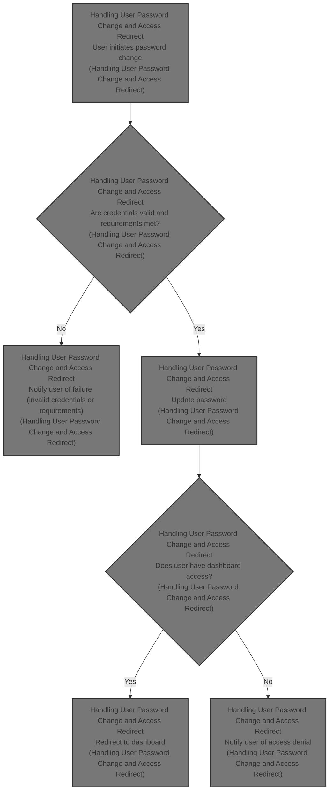

This document describes how users change their password and are redirected to the dashboard if access is granted. The flow validates user credentials, enforces password requirements, updates the password, and manages dashboard access.



# Handling User Password Change and Access Redirect

```mermaid
%%{init: {"flowchart": {"defaultRenderer": "elk"}} }%%
flowchart TD
    node1["User initiates password change"]
    click node1 openCode "Form/frmUserChangePassword.frm:365:366"
    node1 --> node2{"Has old password been entered?"}
    click node2 openCode "Form/frmUserChangePassword.frm:370:374"
    node2 -->|"No"| node3["Prompt: Enter old password"]
    click node3 openCode "Form/frmUserChangePassword.frm:371:373"
    node2 -->|"Yes"| node4{"Has new password been entered?"}
    click node4 openCode "Form/frmUserChangePassword.frm:375:379"
    node4 -->|"No"| node5["Prompt: Enter new password"]
    click node5 openCode "Form/frmUserChangePassword.frm:376:378"
    node4 -->|"Yes"| node6["Check old password"]
    click node6 openCode "Form/frmUserChangePassword.frm:381:384"
    node6 --> node7{"Is old password correct?"}
    click node7 openCode "Form/frmUserChangePassword.frm:381:384"
    node7 -->|"No"| node8["Prompt: Old password incorrect"]
    click node8 openCode "Form/frmUserChangePassword.frm:382:383"
    node7 -->|"Yes"| node9{"Is new password at least 4 characters?"}
    click node9 openCode "Form/frmUserChangePassword.frm:390:394"
    node9 -->|"No"| node10["Prompt: Password must be at least 4 characters"]
    click node10 openCode "Form/frmUserChangePassword.frm:391:393"
    node9 -->|"Yes"| node11{"Does new password match confirmation?"}
    click node11 openCode "Form/frmUserChangePassword.frm:395:402"
    node11 -->|"No"| node12["Prompt: Confirm password"]
    click node12 openCode "Form/frmUserChangePassword.frm:399:401"
    node11 -->|"Yes"| node13["Update password"]
    click node13 openCode "Form/frmUserChangePassword.frm:396:397"
    node13 --> node14["Check dashboard access"]
    click node14 openCode "Form/frmUserChangePassword.frm:403:410"
    node14 --> node15{"Does user have dashboard access?"}
    click node15 openCode "Form/frmUserChangePassword.frm:403:410"
    node15 -->|"Yes"| node16["Show dashboard"]
    click node16 openCode "Form/frmUserChangePassword.frm:404:405"
    node15 -->|"No"| node17["Prompt: Access disabled"]
    click node17 openCode "Form/frmUserChangePassword.frm:407:409"

classDef HeadingStyle fill:#777777,stroke:#333,stroke-width:2px;

%% Swimm:
%% %%{init: {"flowchart": {"defaultRenderer": "elk"}} }%%
%% flowchart TD
%%     node1["User initiates password change"]
%%     click node1 openCode "<SwmPath>[Form/frmUserChangePassword.frm](Form/frmUserChangePassword.frm)</SwmPath>:365:366"
%%     node1 --> node2{"Has old password been entered?"}
%%     click node2 openCode "<SwmPath>[Form/frmUserChangePassword.frm](Form/frmUserChangePassword.frm)</SwmPath>:370:374"
%%     node2 -->|"No"| node3["Prompt: Enter old password"]
%%     click node3 openCode "<SwmPath>[Form/frmUserChangePassword.frm](Form/frmUserChangePassword.frm)</SwmPath>:371:373"
%%     node2 -->|"Yes"| node4{"Has new password been entered?"}
%%     click node4 openCode "<SwmPath>[Form/frmUserChangePassword.frm](Form/frmUserChangePassword.frm)</SwmPath>:375:379"
%%     node4 -->|"No"| node5["Prompt: Enter new password"]
%%     click node5 openCode "<SwmPath>[Form/frmUserChangePassword.frm](Form/frmUserChangePassword.frm)</SwmPath>:376:378"
%%     node4 -->|"Yes"| node6["Check old password"]
%%     click node6 openCode "<SwmPath>[Form/frmUserChangePassword.frm](Form/frmUserChangePassword.frm)</SwmPath>:381:384"
%%     node6 --> node7{"Is old password correct?"}
%%     click node7 openCode "<SwmPath>[Form/frmUserChangePassword.frm](Form/frmUserChangePassword.frm)</SwmPath>:381:384"
%%     node7 -->|"No"| node8["Prompt: Old password incorrect"]
%%     click node8 openCode "<SwmPath>[Form/frmUserChangePassword.frm](Form/frmUserChangePassword.frm)</SwmPath>:382:383"
%%     node7 -->|"Yes"| node9{"Is new password at least 4 characters?"}
%%     click node9 openCode "<SwmPath>[Form/frmUserChangePassword.frm](Form/frmUserChangePassword.frm)</SwmPath>:390:394"
%%     node9 -->|"No"| node10["Prompt: Password must be at least 4 characters"]
%%     click node10 openCode "<SwmPath>[Form/frmUserChangePassword.frm](Form/frmUserChangePassword.frm)</SwmPath>:391:393"
%%     node9 -->|"Yes"| node11{"Does new password match confirmation?"}
%%     click node11 openCode "<SwmPath>[Form/frmUserChangePassword.frm](Form/frmUserChangePassword.frm)</SwmPath>:395:402"
%%     node11 -->|"No"| node12["Prompt: Confirm password"]
%%     click node12 openCode "<SwmPath>[Form/frmUserChangePassword.frm](Form/frmUserChangePassword.frm)</SwmPath>:399:401"
%%     node11 -->|"Yes"| node13["Update password"]
%%     click node13 openCode "<SwmPath>[Form/frmUserChangePassword.frm](Form/frmUserChangePassword.frm)</SwmPath>:396:397"
%%     node13 --> node14["Check dashboard access"]
%%     click node14 openCode "<SwmPath>[Form/frmUserChangePassword.frm](Form/frmUserChangePassword.frm)</SwmPath>:403:410"
%%     node14 --> node15{"Does user have dashboard access?"}
%%     click node15 openCode "<SwmPath>[Form/frmUserChangePassword.frm](Form/frmUserChangePassword.frm)</SwmPath>:403:410"
%%     node15 -->|"Yes"| node16["Show dashboard"]
%%     click node16 openCode "<SwmPath>[Form/frmUserChangePassword.frm](Form/frmUserChangePassword.frm)</SwmPath>:404:405"
%%     node15 -->|"No"| node17["Prompt: Access disabled"]
%%     click node17 openCode "<SwmPath>[Form/frmUserChangePassword.frm](Form/frmUserChangePassword.frm)</SwmPath>:407:409"
%% 
%% classDef HeadingStyle fill:#777777,stroke:#333,stroke-width:2px;
```



<SwmSnippet path="/Form/frmUserChangePassword.frm" line="365">

---

In <SwmToken path="Form/frmUserChangePassword.frm" pos="365:4:4" line-data="Private Sub cmdOK_Click()">`cmdOK_Click`</SwmToken>, we check for empty password fields and then call <SwmToken path="Form/frmUserChangePassword.frm" pos="381:3:3" line-data="    If CheckPassword(strPass) = False Then">`CheckPassword`</SwmToken> to verify the old password before moving forward.

```visual basic
Private Sub cmdOK_Click()
    Const mstrMethod As String = "cmdOK_Click"
    Dim strPass As String
    Dim strNew As String
On Error GoTo CheckErr
    If Trim(txtPasswordOld.Text) = "" Then
        MsgBox "Please enter your Old Password!", vbExclamation, mstrModule
        txtPasswordOld.SetFocus
        Exit Sub
    End If
    If Trim(txtPasswordNew.Text) = "" Then
        MsgBox "Please enter your New Password!", vbExclamation, mstrModule
        txtPasswordNew.SetFocus
        Exit Sub
    End If
    strPass = CheckInput(txtPasswordOld.Text)
    If CheckPassword(strPass) = False Then
        MsgBox "Old Password is incorrect!", vbExclamation, mstrModule
        Exit Sub
    End If
```

---

</SwmSnippet>

<SwmSnippet path="/Form/frmUserChangePassword.frm" line="428">

---

<SwmToken path="Form/frmUserChangePassword.frm" pos="428:4:4" line-data="Private Function CheckPassword(strPassword As String) As Boolean">`CheckPassword`</SwmToken> grabs the stored password hash and salt for the current user, combines the input password with the salt, encodes it, and checks if it matches the stored hash. This is how we confirm the old password is correct before allowing any changes.

```visual basic
Private Function CheckPassword(strPassword As String) As Boolean
    Const mstrMethod As String = "CheckPassword"
    Dim rst As ADODB.Recordset
    Dim strCheck As String
On Error GoTo CheckErr
    SQL_SELECT
    SQLText "UserPassword"
    SQLText "Salt", False
    SQL_FROM "UserData"
    SQL_WHERE_Text "UserID", gstrUserID
    OpenDB
    Set rst = OpenSQL(gstrSQL)
    If Not rst.EOF Then
        strCheck = strPassword & rst!Salt
        strCheck = GoldFishEncode(strCheck)
        If rst!UserPassword = strCheck Then
            CheckPassword = True
        Else
            CheckPassword = False
        End If
    Else
        CheckPassword = False
    End If
    CloseRS rst
    CloseDB
    Exit Function
CheckErr:
    MsgBox Err.Number & " - " & Err.Description, vbExclamation, mstrMethod
    'LogErrorText "Error", mstrMethod, Err.Description
    LogErrorDB "Function", mstrModule, mstrMethod, Err.Number, Err.Description
End Function
```

---

</SwmSnippet>

<SwmSnippet path="/Form/frmUserChangePassword.frm" line="385">

---

Back in <SwmToken path="Form/frmUserChangePassword.frm" pos="365:4:4" line-data="Private Sub cmdOK_Click()">`cmdOK_Click`</SwmToken>, after confirming the old password, we check the new password's length and make sure it matches the confirmation. If everything checks out, we sanitize the new password and call <SwmToken path="Form/frmUserChangePassword.frm" pos="397:1:1" line-data="        UpdatePassword strNew">`UpdatePassword`</SwmToken> to actually change it in the database.

```visual basic
'    If txtPasswordNew.Text = "" Then
'        MsgBox "Password cannot empty!", vbExclamation, mstrModule
'        txtPasswordNew.SetFocus
'        Exit Sub
'    End If
    If Len(txtPasswordNew.Text) < 4 Then
        MsgBox "Password must at least 4 characters!", vbExclamation, mstrModule
        txtPasswordNew.SetFocus
        Exit Sub
    End If
    If txtPasswordNew.Text = txtPasswordConfirm.Text Then
        strNew = CheckInput(txtPasswordNew.Text)
        UpdatePassword strNew
    Else
        MsgBox "Please confirm Password!", vbExclamation, mstrModule
        txtPasswordConfirm.SetFocus
        Exit Sub
    End If
```

---

</SwmSnippet>

<SwmSnippet path="/Form/frmUserChangePassword.frm" line="460">

---

<SwmToken path="Form/frmUserChangePassword.frm" pos="460:4:4" line-data="Private Sub UpdatePassword(strPassword As String)">`UpdatePassword`</SwmToken> generates a new salt, encrypts the new password with it, updates the database record for the user, and resets the <SwmToken path="Form/frmUserChangePassword.frm" pos="468:4:4" line-data="    SQL_SET_Boolean &quot;ChangePassword&quot;, False, False">`ChangePassword`</SwmToken> flag. The user gets a confirmation message once it's done.

```visual basic
Private Sub UpdatePassword(strPassword As String)
    Const mstrMethod As String = "UpdatePassword"
    Dim mstrSalt As String
On Error GoTo CheckErr
    mstrSalt = GenSalt(4)
    SQL_UPDATE "UserData"
    SQL_SET_Text "UserPassword", Encrypt(strPassword, mstrSalt)
    SQL_SET_Text "Salt", mstrSalt
    SQL_SET_Boolean "ChangePassword", False, False
    SQL_WHERE_Text "UserID", gstrUserID
    OpenDB
    QuerySQL gstrSQL
    CloseDB
    MsgBox "Password is updated!", vbInformation, mstrModule
    Exit Sub
CheckErr:
    MsgBox Err.Number & " - " & Err.Description, vbExclamation, mstrMethod
    'LogErrorText "Error", mstrMethod, Err.Description
    LogErrorDB "Sub", mstrModule, mstrMethod, Err.Number, Err.Description
End Sub
```

---

</SwmSnippet>

<SwmSnippet path="/Form/frmUserChangePassword.frm" line="403">

---

After <SwmToken path="Form/frmUserChangePassword.frm" pos="397:1:1" line-data="        UpdatePassword strNew">`UpdatePassword`</SwmToken> in <SwmToken path="Form/frmUserChangePassword.frm" pos="365:4:4" line-data="Private Sub cmdOK_Click()">`cmdOK_Click`</SwmToken>, we check if the user has access to the dashboard. Depending on the result, we either show the dashboard or notify the user that their access is disabled.

```visual basic
    If UserAccessModule(MOD_DASHBOARD) Then
        frmDashboard.Show
        Unload Me
    Else
        MsgBox "Your access has been disabled!", vbExclamation, mstrModule
```

---

</SwmSnippet>

<SwmSnippet path="/Module/modFunction.bas" line="84">

---

<SwmToken path="Module/modFunction.bas" pos="84:4:4" line-data="Public Function UserAccessModule(intModuleID As Integer, Optional strUserID As String = &quot;&quot;) As Boolean">`UserAccessModule`</SwmToken> checks the module's access flags for each group, finds the user's group, and returns whether that group has access to the requested module. If data is missing, access is denied.

```visual basic
Public Function UserAccessModule(intModuleID As Integer, Optional strUserID As String = "") As Boolean
    Const mstrMethod As String = "UserAccessModule"
    Dim rst As ADODB.Recordset
    Dim strSQL As String
    Dim blnGroup(1 To 4) As Boolean
On Error GoTo CheckErr
    If strUserID = "" Then strUserID = gstrUserID
    strSQL = "SELECT * FROM ModuleAccess"
    strSQL = strSQL & " WHERE ModuleID = " & intModuleID
    OpenDB
    Set rst = OpenRS(strSQL)
    If Not rst.EOF Then
        blnGroup(1) = rst!Group1
        blnGroup(2) = rst!Group2
        blnGroup(3) = rst!Group3
        blnGroup(4) = rst!Group4
    Else
        blnGroup(1) = False
        blnGroup(2) = False
        blnGroup(3) = False
        blnGroup(4) = False
    End If
    CloseRS rst
    strSQL = "SELECT UserGroup"
    strSQL = strSQL & " FROM UserData"
    strSQL = strSQL & " WHERE UserID = '" & strUserID & "'"
    Set rst = OpenRS(strSQL)
    If Not rst.EOF Then
        If rst!UserGroup = 1 Then
            UserAccessModule = blnGroup(1)
        ElseIf rst!UserGroup = 2 Then
            UserAccessModule = blnGroup(2)
        ElseIf rst!UserGroup = 3 Then
            UserAccessModule = blnGroup(3)
        Else ' rst!UserGroup = 4
            UserAccessModule = blnGroup(4)
        End If
    Else
        UserAccessModule = False
    End If
    CloseRS rst
    CloseDB
    Exit Function
CheckErr:
    CloseRS rst
    CloseDB
    UserAccessModule = False
    MsgBox Err.Number & " - " & Err.Description, vbExclamation, mstrMethod
    'LogError "Error", mstrMethod, Err.Description
    LogErrorDB "Function", mstrModule, mstrMethod, Err.Number, Err.Description
End Function
```

---

</SwmSnippet>

<SwmSnippet path="/Form/frmUserChangePassword.frm" line="408">

---

After checking access in <SwmToken path="Form/frmUserChangePassword.frm" pos="365:4:4" line-data="Private Sub cmdOK_Click()">`cmdOK_Click`</SwmToken>, if the user is allowed, they're redirected to the dashboard. If not, they get an access denied message and the form closes. This wraps up the password change and access flow.

```visual basic
        'frmBooking.Show
        Unload Me
    End If
    Exit Sub
CheckErr:
    MsgBox Err.Number & " - " & Err.Description, vbExclamation, mstrMethod
    'LogErrorText "Error", mstrMethod, Err.Description
    LogErrorDB "Sub", mstrModule, mstrMethod, Err.Number, Err.Description
End Sub
```

---

</SwmSnippet>

&nbsp;

*This is an auto-generated document by Swimm 🌊 and has not yet been verified by a human*

<SwmMeta version="3.0.0" repo-id="Z2l0aHViJTNBJTNBc3Rhci1ob3RlbC12YjYlM0ElM0FtdWRhc2luMQ==" repo-name="star-hotel-vb6"><sup>Powered by [Swimm](https://app.swimm.io/)</sup></SwmMeta>
