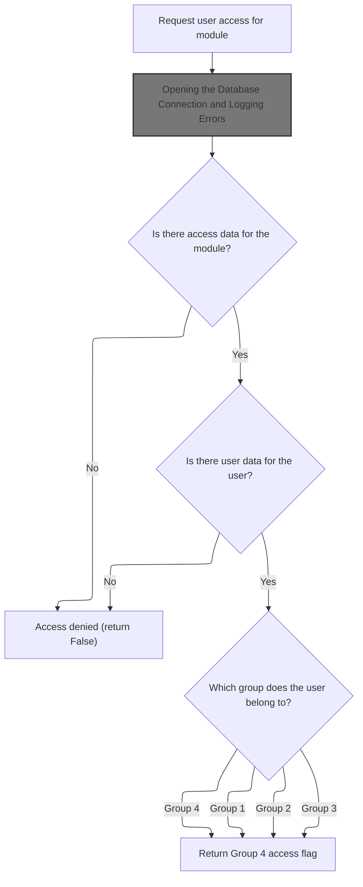
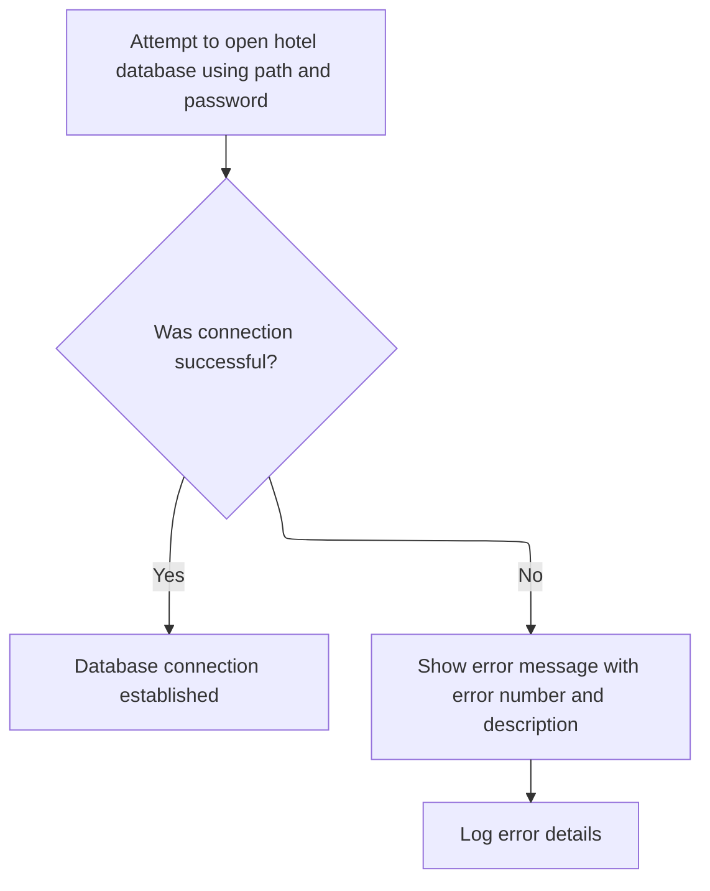
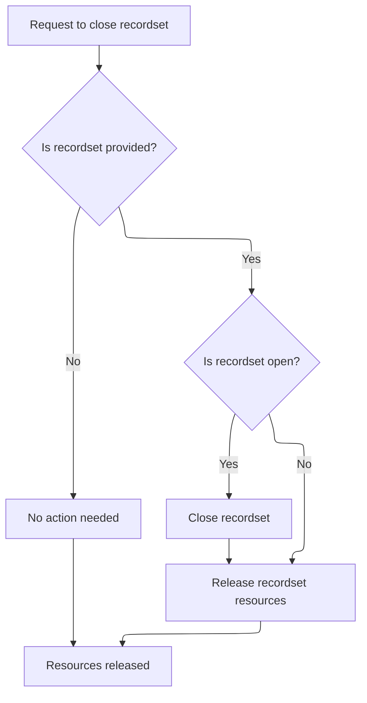
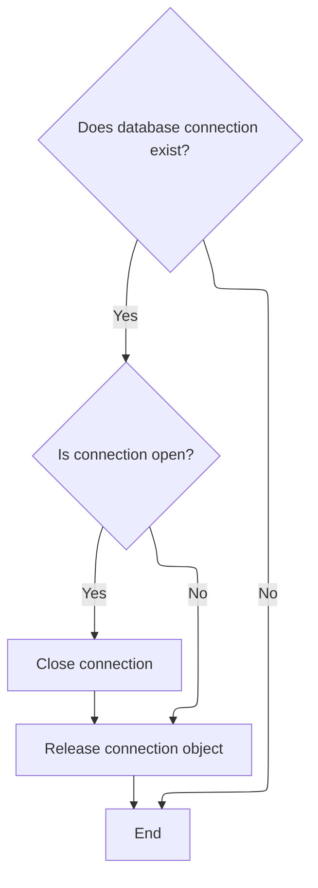
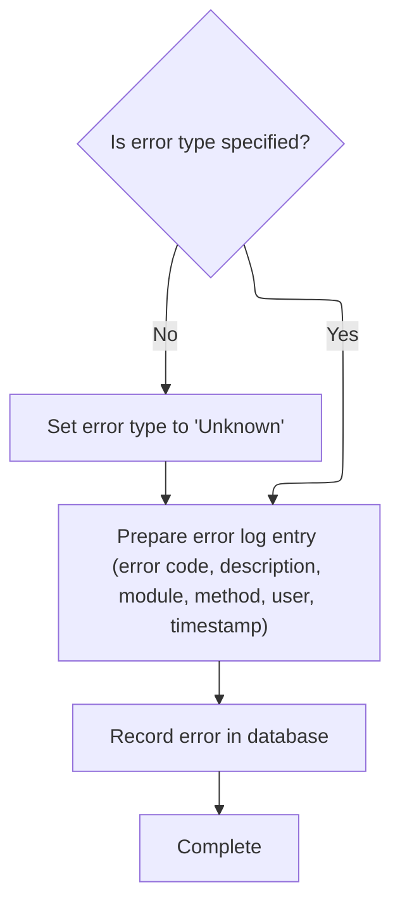

This document describes how the system determines if a user can access a specific module. The process begins with a request to check access, retrieves the module's permissions and the user's group from the database, and then makes an access decision based on these factors.

# Where is this flow used?

This flow is used multiple times in the codebase as represented in the following diagram:

```mermaid
graph TD;
      632cdedb2fef9ac1425b7f13b33b1b5e9f74c8b16bfbc45e731b64aa59f02104(Form/frmUserChangePassword.frm::Form_Unload) --> 943db170f902b17f3e7c1fcc2d49aca7f82ea5a5eb3bc7ea246cc6f77df93d85(Module/modFunction.bas::UserAccessModule):::mainFlowStyle

6d5dfaa1535df03c2e73af44d3d5f08664c1a96b6cef4ca1650ab07ed9b64539(Form/frmUserChangePassword.frm::cmdOK_Click) --> 943db170f902b17f3e7c1fcc2d49aca7f82ea5a5eb3bc7ea246cc6f77df93d85(Module/modFunction.bas::UserAccessModule):::mainFlowStyle

f9ae32f25f27c084655bcf4815d4a37946a485e140be3fc266b2ccd63a052a14(Form/frmUserLogin.frm::cmdOK_Click) --> 943db170f902b17f3e7c1fcc2d49aca7f82ea5a5eb3bc7ea246cc6f77df93d85(Module/modFunction.bas::UserAccessModule):::mainFlowStyle


classDef mainFlowStyle color:#000000,fill:#7CB9F4
classDef rootsStyle color:#000000,fill:#00FFF4
classDef Style1 color:#000000,fill:#00FFAA
classDef Style2 color:#000000,fill:#FFFF00
classDef Style3 color:#000000,fill:#AA7CB9

%% Swimm:
%% graph TD;
%%       632cdedb2fef9ac1425b7f13b33b1b5e9f74c8b16bfbc45e731b64aa59f02104(<SwmPath>[Form/frmUserChangePassword.frm](Form/frmUserChangePassword.frm)</SwmPath>::Form_Unload) --> 943db170f902b17f3e7c1fcc2d49aca7f82ea5a5eb3bc7ea246cc6f77df93d85(<SwmPath>[Module/modFunction.bas](Module/modFunction.bas)</SwmPath>::<SwmToken path="Module/modFunction.bas" pos="84:4:4" line-data="Public Function UserAccessModule(intModuleID As Integer, Optional strUserID As String = &quot;&quot;) As Boolean">`UserAccessModule`</SwmToken>):::mainFlowStyle
%% 
%% 6d5dfaa1535df03c2e73af44d3d5f08664c1a96b6cef4ca1650ab07ed9b64539(<SwmPath>[Form/frmUserChangePassword.frm](Form/frmUserChangePassword.frm)</SwmPath>::cmdOK_Click) --> 943db170f902b17f3e7c1fcc2d49aca7f82ea5a5eb3bc7ea246cc6f77df93d85(<SwmPath>[Module/modFunction.bas](Module/modFunction.bas)</SwmPath>::<SwmToken path="Module/modFunction.bas" pos="84:4:4" line-data="Public Function UserAccessModule(intModuleID As Integer, Optional strUserID As String = &quot;&quot;) As Boolean">`UserAccessModule`</SwmToken>):::mainFlowStyle
%% 
%% f9ae32f25f27c084655bcf4815d4a37946a485e140be3fc266b2ccd63a052a14(<SwmPath>[Form/frmUserLogin.frm](Form/frmUserLogin.frm)</SwmPath>::cmdOK_Click) --> 943db170f902b17f3e7c1fcc2d49aca7f82ea5a5eb3bc7ea246cc6f77df93d85(<SwmPath>[Module/modFunction.bas](Module/modFunction.bas)</SwmPath>::<SwmToken path="Module/modFunction.bas" pos="84:4:4" line-data="Public Function UserAccessModule(intModuleID As Integer, Optional strUserID As String = &quot;&quot;) As Boolean">`UserAccessModule`</SwmToken>):::mainFlowStyle
%% 
%% 
%% classDef mainFlowStyle color:#000000,fill:#7CB9F4
%% classDef rootsStyle color:#000000,fill:#00FFF4
%% classDef Style1 color:#000000,fill:#00FFAA
%% classDef Style2 color:#000000,fill:#FFFF00
%% classDef Style3 color:#000000,fill:#AA7CB9
```



# Checking User Permissions for a Module



<SwmSnippet path="/Module/modFunction.bas" line="84">

---

In <SwmToken path="Module/modFunction.bas" pos="84:4:4" line-data="Public Function UserAccessModule(intModuleID As Integer, Optional strUserID As String = &quot;&quot;) As Boolean">`UserAccessModule`</SwmToken>, we start by figuring out which user we're checking (using the provided ID or the global one), then we prep to pull access rights for the module from the database. We need to call <SwmToken path="Module/modFunction.bas" pos="93:1:1" line-data="    OpenDB">`OpenDB`</SwmToken> next because the access checks depend on reading from the database tables (<SwmToken path="Module/modFunction.bas" pos="91:12:12" line-data="    strSQL = &quot;SELECT * FROM ModuleAccess&quot;">`ModuleAccess`</SwmToken> and <SwmToken path="Module/modFunction.bas" pos="108:13:13" line-data="    strSQL = strSQL &amp; &quot; FROM UserData&quot;">`UserData`</SwmToken>).

```visual basic
Public Function UserAccessModule(intModuleID As Integer, Optional strUserID As String = "") As Boolean
    Const mstrMethod As String = "UserAccessModule"
    Dim rst As ADODB.Recordset
    Dim strSQL As String
    Dim blnGroup(1 To 4) As Boolean
On Error GoTo CheckErr
    If strUserID = "" Then strUserID = gstrUserID
    strSQL = "SELECT * FROM ModuleAccess"
    strSQL = strSQL & " WHERE ModuleID = " & intModuleID
    OpenDB
    Set rst = OpenRS(strSQL)
    If Not rst.EOF Then
        blnGroup(1) = rst!Group1
        blnGroup(2) = rst!Group2
        blnGroup(3) = rst!Group3
        blnGroup(4) = rst!Group4
    Else
        blnGroup(1) = False
        blnGroup(2) = False
        blnGroup(3) = False
        blnGroup(4) = False
    End If
    CloseRS rst
    strSQL = "SELECT UserGroup"
    strSQL = strSQL & " FROM UserData"
    strSQL = strSQL & " WHERE UserID = '" & strUserID & "'"
    Set rst = OpenRS(strSQL)
    If Not rst.EOF Then
        If rst!UserGroup = 1 Then
            UserAccessModule = blnGroup(1)
        ElseIf rst!UserGroup = 2 Then
            UserAccessModule = blnGroup(2)
        ElseIf rst!UserGroup = 3 Then
            UserAccessModule = blnGroup(3)
```

---

</SwmSnippet>

## Opening the Database Connection and Logging Errors



<SwmSnippet path="/Module/modDatabase.bas" line="23">

---

In <SwmToken path="Module/modDatabase.bas" pos="23:4:4" line-data="Public Sub OpenDB()">`OpenDB`</SwmToken>, we set up and open the database connection using the configured path and password. If anything fails, we log the error to a text file by calling <SwmToken path="Module/modDatabase.bas" pos="34:1:1" line-data="    LogErrorText &quot;Error&quot;, mstrMethod, Err.Description">`LogErrorText`</SwmToken> in the next module.

```visual basic
Public Sub OpenDB()
Const mstrMethod As String = "OpenDB"
On Error GoTo CheckErr
    Set ACN = New ADODB.Connection
    ACN.Provider = "Microsoft.Jet.OLEDB.4.0"
    ACN.ConnectionString = "Data Source=" & gstrDatabasePath
    ACN.Properties("Jet OLEDB:Database Password") = gstrPassword
    ACN.Open
    Exit Sub
CheckErr:
    MsgBox Err.Number & " - " & Err.Description, vbExclamation, mstrMethod
    LogErrorText "Error", mstrMethod, Err.Description
```

---

</SwmSnippet>

<SwmSnippet path="/Module/modTextFile.bas" line="34">

---

<SwmToken path="Module/modTextFile.bas" pos="34:4:4" line-data="Public Sub LogErrorText(FileName As String, pstrNote As String, Optional pstrError As String)">`LogErrorText`</SwmToken> appends error details (timestamp, note, and error message) to a text file in the app directory. If logging itself fails, it pops up a message box with the error.

```visual basic
Public Sub LogErrorText(FileName As String, pstrNote As String, Optional pstrError As String)
On Error GoTo SE
    Open App.Path & "\" & FileName & ".txt" For Append As #1
    If pstrError = "" Then
        Print #1, vbCrLf & FormatDateAndTime(Now) & vbCrLf & pstrNote
    Else
        Print #1, vbCrLf & FormatDateAndTime(Now) & vbCrLf & pstrNote & vbCrLf & pstrError
    End If
    Close #1
    Exit Sub
SE:
    MsgBox "Error #" & Err.Number & vbCrLf & Err.Description, vbExclamation, App.Title
End Sub
```

---

</SwmSnippet>

<SwmSnippet path="/Module/modDatabase.bas" line="35">

---

We just came back from <SwmToken path="Module/modFunction.bas" pos="338:1:1" line-data="    LogErrorText &quot;Error&quot;, mstrMethod, Err.Description">`LogErrorText`</SwmToken> in <SwmToken path="Module/modFunction.bas" pos="93:1:1" line-data="    OpenDB">`OpenDB`</SwmToken>. After logging the error, the function simply ends—no retries or extra handling here.

```visual basic
    'LogErrorDB "Sub", mstrModule, mstrMethod, Err.Number, Err.Description
End Sub
```

---

</SwmSnippet>

## Fetching User Group and Returning Access Decision

<SwmSnippet path="/Module/modFunction.bas" line="118">

---

We just got back from <SwmToken path="Module/modFunction.bas" pos="93:1:1" line-data="    OpenDB">`OpenDB`</SwmToken> in <SwmToken path="Module/modFunction.bas" pos="119:1:1" line-data="            UserAccessModule = blnGroup(4)">`UserAccessModule`</SwmToken>. Now, we check the user's group and return the corresponding group permission. If the user isn't found, access is denied. We close the recordset with <SwmToken path="Module/modFunction.bas" pos="124:1:1" line-data="    CloseRS rst">`CloseRS`</SwmToken> next to clean up resources.

```visual basic
        Else ' rst!UserGroup = 4
            UserAccessModule = blnGroup(4)
        End If
    Else
        UserAccessModule = False
    End If
    CloseRS rst
```

---

</SwmSnippet>

## Cleaning Up Recordset Resources



<SwmSnippet path="/Module/modDatabase.bas" line="1337">

---

In <SwmToken path="Module/modDatabase.bas" pos="1337:4:4" line-data="Public Sub CloseRS(rst As ADODB.Recordset)">`CloseRS`</SwmToken>, we make sure the recordset is closed and dereferenced. If something goes wrong, we log the error to a text file by calling <SwmToken path="Module/modDatabase.bas" pos="1350:1:1" line-data="    LogErrorText &quot;Error&quot;, mstrMethod, Err.Description">`LogErrorText`</SwmToken> next.

```visual basic
Public Sub CloseRS(rst As ADODB.Recordset)
Const mstrMethod As String = "CloseRS"
On Error GoTo CheckErr
    If rst Is Nothing Then
    Else
        If rst.State = adStateOpen Then
            rst.Close
        End If
        Set rst = Nothing
    End If
    Exit Sub
CheckErr:
    MsgBox Err.Number & " - " & Err.Description, vbExclamation, mstrMethod
    LogErrorText "Error", mstrMethod, Err.Description
```

---

</SwmSnippet>

<SwmSnippet path="/Module/modDatabase.bas" line="1351">

---

We just came back from <SwmToken path="Module/modFunction.bas" pos="338:1:1" line-data="    LogErrorText &quot;Error&quot;, mstrMethod, Err.Description">`LogErrorText`</SwmToken> in <SwmToken path="Module/modFunction.bas" pos="106:1:1" line-data="    CloseRS rst">`CloseRS`</SwmToken>. After logging, the function ends—no further action is taken.

```visual basic
    'LogErrorDB "Sub", mstrModule, mstrMethod, Err.Number, Err.Description
End Sub
```

---

</SwmSnippet>

## Finalizing Access Check and Closing Connection

<SwmSnippet path="/Module/modFunction.bas" line="125">

---

We just returned from <SwmToken path="Module/modFunction.bas" pos="106:1:1" line-data="    CloseRS rst">`CloseRS`</SwmToken> in <SwmToken path="Module/modFunction.bas" pos="84:4:4" line-data="Public Function UserAccessModule(intModuleID As Integer, Optional strUserID As String = &quot;&quot;) As Boolean">`UserAccessModule`</SwmToken>. Now we close the database connection with <SwmToken path="Module/modFunction.bas" pos="125:1:1" line-data="    CloseDB">`CloseDB`</SwmToken> to free up resources before exiting the function.

```visual basic
    CloseDB
    Exit Function
CheckErr:
```

---

</SwmSnippet>

## Releasing Database Connection Resources



<SwmSnippet path="/Module/modDatabase.bas" line="55">

---

In <SwmToken path="Module/modDatabase.bas" pos="55:4:4" line-data="Public Sub CloseDB()">`CloseDB`</SwmToken>, we close and release the database connection if it's open. If something goes wrong, we log the error to a text file by calling <SwmToken path="Module/modDatabase.bas" pos="68:1:1" line-data="    LogErrorText &quot;Error&quot;, mstrMethod, Err.Description">`LogErrorText`</SwmToken> next.

```visual basic
Public Sub CloseDB()
Const mstrMethod As String = "CloseDB"
On Error GoTo CheckErr
    If ACN Is Nothing Then
    Else
        If ACN.State = adStateOpen Then
            ACN.Close
        End If
        Set ACN = Nothing
    End If
    Exit Sub
CheckErr:
    MsgBox Err.Number & " - " & Err.Description, vbExclamation, mstrMethod
    LogErrorText "Error", mstrMethod, Err.Description
```

---

</SwmSnippet>

<SwmSnippet path="/Module/modDatabase.bas" line="69">

---

We just came back from <SwmToken path="Module/modFunction.bas" pos="338:1:1" line-data="    LogErrorText &quot;Error&quot;, mstrMethod, Err.Description">`LogErrorText`</SwmToken> in <SwmToken path="Module/modFunction.bas" pos="125:1:1" line-data="    CloseDB">`CloseDB`</SwmToken>. After logging, the function ends—no further action is taken.

```visual basic
    'LogErrorDB "Sub", mstrModule, mstrMethod, Err.Number, Err.Description
End Sub
```

---

</SwmSnippet>

## Error Handling and Cleanup in Access Check

<SwmSnippet path="/Module/modFunction.bas" line="128">

---

We just returned from <SwmToken path="Module/modFunction.bas" pos="125:1:1" line-data="    CloseDB">`CloseDB`</SwmToken> in <SwmToken path="Module/modFunction.bas" pos="84:4:4" line-data="Public Function UserAccessModule(intModuleID As Integer, Optional strUserID As String = &quot;&quot;) As Boolean">`UserAccessModule`</SwmToken>. If we're in the error handler, we call <SwmToken path="Module/modFunction.bas" pos="128:1:1" line-data="    CloseRS rst">`CloseRS`</SwmToken> again to make sure the recordset is cleaned up, even after an error.

```visual basic
    CloseRS rst
```

---

</SwmSnippet>

<SwmSnippet path="/Module/modFunction.bas" line="129">

---

We just returned from <SwmToken path="Module/modFunction.bas" pos="106:1:1" line-data="    CloseRS rst">`CloseRS`</SwmToken> in <SwmToken path="Module/modFunction.bas" pos="130:1:1" line-data="    UserAccessModule = False">`UserAccessModule`</SwmToken>. Now we call <SwmToken path="Module/modFunction.bas" pos="129:1:1" line-data="    CloseDB">`CloseDB`</SwmToken> again to make sure the DB connection is closed after an error, set the return value to False, and show an error message.

```visual basic
    CloseDB
    UserAccessModule = False
    MsgBox Err.Number & " - " & Err.Description, vbExclamation, mstrMethod
```

---

</SwmSnippet>

<SwmSnippet path="/Module/modFunction.bas" line="132">

---

We just returned from <SwmToken path="Module/modFunction.bas" pos="125:1:1" line-data="    CloseDB">`CloseDB`</SwmToken> in <SwmToken path="Module/modFunction.bas" pos="84:4:4" line-data="Public Function UserAccessModule(intModuleID As Integer, Optional strUserID As String = &quot;&quot;) As Boolean">`UserAccessModule`</SwmToken>. Finally, we log the error details to the database with <SwmToken path="Module/modFunction.bas" pos="133:1:1" line-data="    LogErrorDB &quot;Function&quot;, mstrModule, mstrMethod, Err.Number, Err.Description">`LogErrorDB`</SwmToken> for tracking and debugging.

```visual basic
    'LogError "Error", mstrMethod, Err.Description
    LogErrorDB "Function", mstrModule, mstrMethod, Err.Number, Err.Description
End Function
```

---

</SwmSnippet>

# Logging Errors to the Database with Timestamps



<SwmSnippet path="/Module/modFunction.bas" line="307">

---

In <SwmToken path="Module/modFunction.bas" pos="307:4:4" line-data="Public Sub LogErrorDB(LogType As String, LogModule As String, LogMethod As String, ErrorNumber As String, Optional ErrorDescription As String)">`LogErrorDB`</SwmToken>, we build an SQL INSERT to log error details, including a formatted timestamp. We call <SwmToken path="Module/modFunction.bas" pos="321:15:15" line-data="    strSQL = strSQL &amp; &quot;#&quot; &amp; FormatDateAndTime(Now) &amp; &quot;#,&quot;">`FormatDateAndTime`</SwmToken> next to get the right date/time string.

```visual basic
Public Sub LogErrorDB(LogType As String, LogModule As String, LogMethod As String, ErrorNumber As String, Optional ErrorDescription As String)
    Const mstrMethod As String = "LogErrorDB"
    Dim strSQL As String
On Error GoTo CheckErr
    If LogType = "" Then LogType = "Unknown"
    strSQL = "INSERT INTO LogError ("
    strSQL = strSQL & " LogDateTime,"
    strSQL = strSQL & " LogErrorNum,"
    strSQL = strSQL & " LogErrorDescription,"
    strSQL = strSQL & " LogUserName,"
    strSQL = strSQL & " LogModule,"
    strSQL = strSQL & " LogMethod,"
    strSQL = strSQL & " LogType)"
    strSQL = strSQL & " VALUES ("
    strSQL = strSQL & "#" & FormatDateAndTime(Now) & "#,"
    strSQL = strSQL & " '" & CheckInput(ErrorNumber) & "',"
    strSQL = strSQL & " '" & CheckInput(ErrorDescription) & "',"
    strSQL = strSQL & " '" & gstrUserID & "',"
    strSQL = strSQL & " '" & CheckInput(LogModule) & "',"
    strSQL = strSQL & " '" & CheckInput(LogMethod) & "',"
    strSQL = strSQL & " '" & CheckInput(LogType) & "')"
```

---

</SwmSnippet>

<SwmSnippet path="/Module/modCommon.bas" line="134">

---

<SwmToken path="Module/modCommon.bas" pos="134:4:4" line-data="Public Function FormatDateAndTime(dtDate As Date) As String">`FormatDateAndTime`</SwmToken> just returns the date/time as a readable string like '01 Jan 2024 10:30:00 AM'.

```visual basic
Public Function FormatDateAndTime(dtDate As Date) As String
    FormatDateAndTime = Format(dtDate, "dd MMM yyyy hh:mm:ss AMPM")
End Function
```

---

</SwmSnippet>

<SwmSnippet path="/Module/modFunction.bas" line="328">

---

We just got the formatted timestamp from <SwmToken path="Module/modFunction.bas" pos="321:15:15" line-data="    strSQL = strSQL &amp; &quot;#&quot; &amp; FormatDateAndTime(Now) &amp; &quot;#,&quot;">`FormatDateAndTime`</SwmToken> in <SwmToken path="Module/modFunction.bas" pos="133:1:1" line-data="    LogErrorDB &quot;Function&quot;, mstrModule, mstrMethod, Err.Number, Err.Description">`LogErrorDB`</SwmToken>. Now we open the DB, start a transaction, insert the log, and commit it to keep things consistent.

```visual basic
    OpenDB
    With ACN
        .BeginTrans
        .Execute strSQL
        .CommitTrans
    End With
```

---

</SwmSnippet>

<SwmSnippet path="/Module/modFunction.bas" line="334">

---

We just finished the transaction in <SwmToken path="Module/modFunction.bas" pos="133:1:1" line-data="    LogErrorDB &quot;Function&quot;, mstrModule, mstrMethod, Err.Number, Err.Description">`LogErrorDB`</SwmToken>. Now we close the DB connection to clean up before exiting.

```visual basic
    CloseDB
    Exit Sub
CheckErr:
```

---

</SwmSnippet>

<SwmSnippet path="/Module/modFunction.bas" line="337">

---

We just returned from <SwmToken path="Module/modFunction.bas" pos="125:1:1" line-data="    CloseDB">`CloseDB`</SwmToken> in <SwmToken path="Module/modFunction.bas" pos="133:1:1" line-data="    LogErrorDB &quot;Function&quot;, mstrModule, mstrMethod, Err.Number, Err.Description">`LogErrorDB`</SwmToken>. If logging to the DB fails, we fall back to writing the error to a text file with <SwmToken path="Module/modFunction.bas" pos="338:1:1" line-data="    LogErrorText &quot;Error&quot;, mstrMethod, Err.Description">`LogErrorText`</SwmToken>.

```visual basic
    'MsgBox Err.Number & " - " & Err.Description, vbExclamation, mstrMethod
    LogErrorText "Error", mstrMethod, Err.Description
End Sub
```

---

</SwmSnippet>

&nbsp;

*This is an auto-generated document by Swimm 🌊 and has not yet been verified by a human*

<SwmMeta version="3.0.0" repo-id="Z2l0aHViJTNBJTNBc3Rhci1ob3RlbC12YjYlM0ElM0FtdWRhc2luMQ==" repo-name="star-hotel-vb6"><sup>Powered by [Swimm](https://app.swimm.io/)</sup></SwmMeta>
