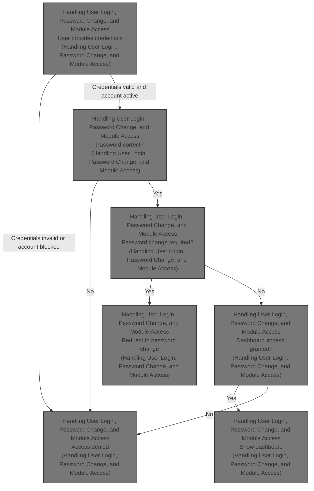

This document outlines how users are authenticated and granted access to the dashboard. Users enter their credentials, which are checked for validity and account status. If the password matches and the account is active, users may be required to change their password before accessing the dashboard. Access is determined by group permissions, and repeated failed login attempts can result in the account being blocked.



# Handling User Login, Password Change, and Module Access

```mermaid
%%{init: {"flowchart": {"defaultRenderer": "elk"}} }%%
flowchart TD
    node1["User attempts login"] --> node2{"Is User ID entered?"}
    click node1 openCode "Form/frmUserLogin.frm:411:423"
    node2 -->|"No"| node3["Prompt: Enter User ID"]
    click node3 openCode "Form/frmUserLogin.frm:423:427"
    node2 -->|"Yes"| node4{"Is Password entered?"}
    click node4 openCode "Form/frmUserLogin.frm:428:432"
    node4 -->|"No"| node5["Prompt: Enter Password"]
    click node5 openCode "Form/frmUserLogin.frm:428:432"
    node4 -->|"Yes"| node6{"Does User ID exist in system?"}
    click node6 openCode "Form/frmUserLogin.frm:433:463"
    node6 -->|"No"| node7["Prompt: User ID not found"]
    click node7 openCode "Form/frmUserLogin.frm:456:463"
    node6 -->|"Yes"| node8{"Is account active?"}
    click node8 openCode "Form/frmUserLogin.frm:464:489"
    node8 -->|"No"| node9["Prompt: Account frozen"]
    click node9 openCode "Form/frmUserLogin.frm:484:489"
    node8 -->|"Yes"| node10{"Has user exceeded allowed login attempts (>2)?"}
    click node10 openCode "Form/frmUserLogin.frm:491:501"
    node10 -->|"Yes"| node11["Freeze account and quit"]
    click node11 openCode "Form/frmUserLogin.frm:491:501"
    node10 -->|"No"| node12["Encrypt and check password"]
    click node12 openCode "Form/frmUserLogin.frm:504:510"
    node12 --> node13{"Does password match?"}
    click node13 openCode "Form/frmUserLogin.frm:512:551"
    node13 -->|"No"| node14{"Is user group > 1?"}
    click node14 openCode "Form/frmUserLogin.frm:538:549"
    node14 -->|"Yes"| node15["Increment login attempts"]
    click node15 openCode "Form/frmUserLogin.frm:538:549"
    node15 --> node16{"Are attempts now >2?"}
    click node16 openCode "Form/frmUserLogin.frm:543:548"
    node16 -->|"Yes"| node17["Prompt: Too many attempts, quit"]
    click node17 openCode "Form/frmUserLogin.frm:544:547"
    node16 -->|"No"| node18["Prompt: Invalid Password"]
    click node18 openCode "Form/frmUserLogin.frm:553:558"
    node14 -->|"No"| node18
    node13 -->|"Yes"| node19{"Does user need to change password?"}
    click node19 openCode "Form/frmUserLogin.frm:520:525"
    node19 -->|"Yes"| node20["Show password change form"]
    click node20 openCode "Form/frmUserLogin.frm:521:524"
    node19 -->|"No"| node21{"Does user have dashboard access?"}
    click node21 openCode "Form/frmUserLogin.frm:527:533"
    node21 -->|"Yes"| node22["Show dashboard"]
    click node22 openCode "Form/frmUserLogin.frm:529:530"
    node21 -->|"No"| node23["Prompt: Access disabled"]
    click node23 openCode "Form/frmUserLogin.frm:531:533"
classDef HeadingStyle fill:#777777,stroke:#333,stroke-width:2px;

%% Swimm:
%% %%{init: {"flowchart": {"defaultRenderer": "elk"}} }%%
%% flowchart TD
%%     node1["User attempts login"] --> node2{"Is User ID entered?"}
%%     click node1 openCode "<SwmPath>[Form/frmUserLogin.frm](Form/frmUserLogin.frm)</SwmPath>:411:423"
%%     node2 -->|"No"| node3["Prompt: Enter User ID"]
%%     click node3 openCode "<SwmPath>[Form/frmUserLogin.frm](Form/frmUserLogin.frm)</SwmPath>:423:427"
%%     node2 -->|"Yes"| node4{"Is Password entered?"}
%%     click node4 openCode "<SwmPath>[Form/frmUserLogin.frm](Form/frmUserLogin.frm)</SwmPath>:428:432"
%%     node4 -->|"No"| node5["Prompt: Enter Password"]
%%     click node5 openCode "<SwmPath>[Form/frmUserLogin.frm](Form/frmUserLogin.frm)</SwmPath>:428:432"
%%     node4 -->|"Yes"| node6{"Does User ID exist in system?"}
%%     click node6 openCode "<SwmPath>[Form/frmUserLogin.frm](Form/frmUserLogin.frm)</SwmPath>:433:463"
%%     node6 -->|"No"| node7["Prompt: User ID not found"]
%%     click node7 openCode "<SwmPath>[Form/frmUserLogin.frm](Form/frmUserLogin.frm)</SwmPath>:456:463"
%%     node6 -->|"Yes"| node8{"Is account active?"}
%%     click node8 openCode "<SwmPath>[Form/frmUserLogin.frm](Form/frmUserLogin.frm)</SwmPath>:464:489"
%%     node8 -->|"No"| node9["Prompt: Account frozen"]
%%     click node9 openCode "<SwmPath>[Form/frmUserLogin.frm](Form/frmUserLogin.frm)</SwmPath>:484:489"
%%     node8 -->|"Yes"| node10{"Has user exceeded allowed login attempts (>2)?"}
%%     click node10 openCode "<SwmPath>[Form/frmUserLogin.frm](Form/frmUserLogin.frm)</SwmPath>:491:501"
%%     node10 -->|"Yes"| node11["Freeze account and quit"]
%%     click node11 openCode "<SwmPath>[Form/frmUserLogin.frm](Form/frmUserLogin.frm)</SwmPath>:491:501"
%%     node10 -->|"No"| node12["Encrypt and check password"]
%%     click node12 openCode "<SwmPath>[Form/frmUserLogin.frm](Form/frmUserLogin.frm)</SwmPath>:504:510"
%%     node12 --> node13{"Does password match?"}
%%     click node13 openCode "<SwmPath>[Form/frmUserLogin.frm](Form/frmUserLogin.frm)</SwmPath>:512:551"
%%     node13 -->|"No"| node14{"Is user group > 1?"}
%%     click node14 openCode "<SwmPath>[Form/frmUserLogin.frm](Form/frmUserLogin.frm)</SwmPath>:538:549"
%%     node14 -->|"Yes"| node15["Increment login attempts"]
%%     click node15 openCode "<SwmPath>[Form/frmUserLogin.frm](Form/frmUserLogin.frm)</SwmPath>:538:549"
%%     node15 --> node16{"Are attempts now >2?"}
%%     click node16 openCode "<SwmPath>[Form/frmUserLogin.frm](Form/frmUserLogin.frm)</SwmPath>:543:548"
%%     node16 -->|"Yes"| node17["Prompt: Too many attempts, quit"]
%%     click node17 openCode "<SwmPath>[Form/frmUserLogin.frm](Form/frmUserLogin.frm)</SwmPath>:544:547"
%%     node16 -->|"No"| node18["Prompt: Invalid Password"]
%%     click node18 openCode "<SwmPath>[Form/frmUserLogin.frm](Form/frmUserLogin.frm)</SwmPath>:553:558"
%%     node14 -->|"No"| node18
%%     node13 -->|"Yes"| node19{"Does user need to change password?"}
%%     click node19 openCode "<SwmPath>[Form/frmUserLogin.frm](Form/frmUserLogin.frm)</SwmPath>:520:525"
%%     node19 -->|"Yes"| node20["Show password change form"]
%%     click node20 openCode "<SwmPath>[Form/frmUserLogin.frm](Form/frmUserLogin.frm)</SwmPath>:521:524"
%%     node19 -->|"No"| node21{"Does user have dashboard access?"}
%%     click node21 openCode "<SwmPath>[Form/frmUserLogin.frm](Form/frmUserLogin.frm)</SwmPath>:527:533"
%%     node21 -->|"Yes"| node22["Show dashboard"]
%%     click node22 openCode "<SwmPath>[Form/frmUserLogin.frm](Form/frmUserLogin.frm)</SwmPath>:529:530"
%%     node21 -->|"No"| node23["Prompt: Access disabled"]
%%     click node23 openCode "<SwmPath>[Form/frmUserLogin.frm](Form/frmUserLogin.frm)</SwmPath>:531:533"
%% classDef HeadingStyle fill:#777777,stroke:#333,stroke-width:2px;
```



<SwmSnippet path="/Form/frmUserLogin.frm" line="411">

---

In <SwmToken path="Form/frmUserLogin.frm" pos="411:4:4" line-data="Private Sub cmdOK_Click()">`cmdOK_Click`</SwmToken>, we validate credentials, check account status, and verify the password. If all checks pass, we call the password change logic to enforce password policies before letting the user proceed.

```visual basic
Private Sub cmdOK_Click()
    Const mstrMethod As String = "cmdOK_Click"
    Dim rst As ADODB.Recordset
    Dim mblnActive As Integer
    Dim mintLoginAttempts As Integer
    Dim strSalt As String
On Error GoTo CheckErr
    ' Testing Purpose Only
'     If txtUserID.Text = "" And txtPassword.Text = "" Then
'         txtUserID.Text = "CLERK"
'         txtPassword.Text = "1"
'     End If
    If Trim(txtUserID.Text) = "" Then
        MsgBox "Please enter your User ID!", vbExclamation, mstrModule
        txtUserID.SetFocus
        Exit Sub
    End If
    If Trim(txtPassword.Text) = "" Then
        MsgBox "Please enter your Password!", vbExclamation, mstrModule
        txtPassword.SetFocus
        Exit Sub
    End If
'    strPassword = CheckInput(txtPassword.Text)
    SQL_SELECT
    SQLText "UserGroup"
    SQLText "UserID"
    'SQLText "UserThemeID"
    SQLText "UserName"
    SQLText "UserPassword"
    SQLText "Salt"
    SQLText "Idle"
    SQLText "Active"
    SQLText "LoginAttempts"
    SQLText "ChangePassword", False
    SQL_FROM "UserData"
    SQL_WHERE_Text "UserID", CheckInput(txtUserID.Text)
    OpenDB
    Set rst = OpenSQL(gstrSQL)
    'If rst.RecordCount = 0 Then (-1)
    '    'mblnLoad = False
    '    CloseRS rst
    '    CloseDB
    '    Exit Sub
    'End If
    'check for correct password
    If rst.EOF Then
        CloseRS rst
        CloseDB
        MsgBox "User ID not found!", vbExclamation, mstrModule
        txtUserID.SetFocus
        'SendKeys "{Home}+{End}"
        Exit Sub
    End If
    '==============================================================================
        gintUserGroup = rst!UserGroup
        gstrUserID = rst!UserID
        gstrUserName = rst!UserName
        gstrUserPassword = rst!UserPassword
        gstrUserSalt = rst!Salt
        'gblnUserChangePassword = rst!ChangePassword
        If rst!Idle <> "" Then
            gintUserIdle = ConvInt(rst!Idle)
        End If
        gintUserIdle = 0 '10 ' Test
        mblnActive = rst!Active
        mintLoginAttempts = ConvInt(rst!LoginAttempts)
        strSalt = rst!Salt
        CloseRS rst
        CloseDB
        
        If gintUserIdle > 3600 Or gintUserIdle < 0 Then
            gintUserIdle = 0
        End If
        If mblnActive = False Then
            MsgBox "Your User ID has been frozen." & vbCrLf & _
                "Please contact System Administrator.", vbExclamation, mstrModule
            End
            Exit Sub
        End If
        '==============================================================================
        If mintLoginAttempts > 2 Then
            If mblnActive = True Then
                OpenDB
                UpdateField "UserData", "Active", "BOOLEAN", "TRUE", " UserID = '" & CheckInput(txtUserID.Text) & "'"
                CloseDB
            End If
            MsgBox "Your User ID has been frozen." & vbCrLf & _
                    "Please contact System Administrator.", vbExclamation, mstrModule
            End
            Exit Sub
        End If
        
        '==============================================================================
        'Encrypt password so we can check it against the encypted password in the database
        'Read in the salt
        strPassword = txtPassword.Text
        strPassword = strPassword & strSalt
    
        'Encrypt the entered password
        strPassword = GoldFishEncode(strPassword)
            
        If strPassword = gstrUserPassword Then
            'LoginSucceeded = True
            intAttempt = 0
            OpenDB
            UpdateField "UserData", "Loginattempts", "NUMBER", "0", " UserID = '" & CheckInput(txtUserID.Text) & "'"
            CloseDB
            'Me.Hide
            'Check if need to change password
            If NeedChangePassword(gstrUserID) = True Then
                Unload Me
                frmUserChangePassword.Show
                gblnUserChangePassword = False
                Exit Sub
            End If
```

---

</SwmSnippet>

<SwmSnippet path="/Module/modFunction.bas" line="136">

---

<SwmToken path="Module/modFunction.bas" pos="136:4:4" line-data="Public Function NeedChangePassword(strUserID As String) As Boolean">`NeedChangePassword`</SwmToken> checks the database for the user's <SwmToken path="Module/modFunction.bas" pos="141:8:8" line-data="    strSQL = &quot;SELECT ChangePassword&quot;">`ChangePassword`</SwmToken> flag. If it's set, the function returns True, triggering the password change flow in the login process.

```visual basic
Public Function NeedChangePassword(strUserID As String) As Boolean
    Const mstrMethod As String = "NeedChangePassword"
    Dim rst As ADODB.Recordset
    Dim strSQL As String
On Error GoTo CheckErr
    strSQL = "SELECT ChangePassword"
    strSQL = strSQL & " FROM UserData"
    strSQL = strSQL & " WHERE UserID = '" & strUserID & "'"
    OpenDB
    Set rst = OpenRS(strSQL)
    If Not rst.EOF Then
        If rst!ChangePassword = True Then
            NeedChangePassword = True
        Else
            NeedChangePassword = False
        End If
    Else
        NeedChangePassword = False
    End If
    CloseRS rst
    CloseDB
    Exit Function
CheckErr:
    CloseRS rst
    CloseDB
    NeedChangePassword = False
    MsgBox Err.Number & " - " & Err.Description, vbExclamation, mstrMethod
    'LogError "Error", mstrMethod, Err.Description
    LogErrorDB "Function", mstrModule, mstrMethod, Err.Number, Err.Description
End Function
```

---

</SwmSnippet>

<SwmSnippet path="/Form/frmUserLogin.frm" line="526">

---

After returning from the password change check, <SwmToken path="Form/frmUserLogin.frm" pos="411:4:4" line-data="Private Sub cmdOK_Click()">`cmdOK_Click`</SwmToken> checks module access and either shows the dashboard or blocks access.

```visual basic
            ' Check Module Access
            If UserAccessModule(MOD_DASHBOARD) Then
                Unload Me
                frmDashboard.Show
            Else
                MsgBox "Your access has been disabled!", vbExclamation, mstrModule
                Unload Me
            End If
            Exit Sub
        Else
            CloseRS rst
```

---

</SwmSnippet>

<SwmSnippet path="/Module/modFunction.bas" line="84">

---

<SwmToken path="Module/modFunction.bas" pos="84:4:4" line-data="Public Function UserAccessModule(intModuleID As Integer, Optional strUserID As String = &quot;&quot;) As Boolean">`UserAccessModule`</SwmToken> pulls the access flags for all user groups for a given module, then checks the user's group and returns whether they have access. This keeps module access tied to group permissions, not individual users.

```visual basic
Public Function UserAccessModule(intModuleID As Integer, Optional strUserID As String = "") As Boolean
    Const mstrMethod As String = "UserAccessModule"
    Dim rst As ADODB.Recordset
    Dim strSQL As String
    Dim blnGroup(1 To 4) As Boolean
On Error GoTo CheckErr
    If strUserID = "" Then strUserID = gstrUserID
    strSQL = "SELECT * FROM ModuleAccess"
    strSQL = strSQL & " WHERE ModuleID = " & intModuleID
    OpenDB
    Set rst = OpenRS(strSQL)
    If Not rst.EOF Then
        blnGroup(1) = rst!Group1
        blnGroup(2) = rst!Group2
        blnGroup(3) = rst!Group3
        blnGroup(4) = rst!Group4
    Else
        blnGroup(1) = False
        blnGroup(2) = False
        blnGroup(3) = False
        blnGroup(4) = False
    End If
    CloseRS rst
    strSQL = "SELECT UserGroup"
    strSQL = strSQL & " FROM UserData"
    strSQL = strSQL & " WHERE UserID = '" & strUserID & "'"
    Set rst = OpenRS(strSQL)
    If Not rst.EOF Then
        If rst!UserGroup = 1 Then
            UserAccessModule = blnGroup(1)
        ElseIf rst!UserGroup = 2 Then
            UserAccessModule = blnGroup(2)
        ElseIf rst!UserGroup = 3 Then
            UserAccessModule = blnGroup(3)
        Else ' rst!UserGroup = 4
            UserAccessModule = blnGroup(4)
        End If
    Else
        UserAccessModule = False
    End If
    CloseRS rst
    CloseDB
    Exit Function
CheckErr:
    CloseRS rst
    CloseDB
    UserAccessModule = False
    MsgBox Err.Number & " - " & Err.Description, vbExclamation, mstrMethod
    'LogError "Error", mstrMethod, Err.Description
    LogErrorDB "Function", mstrModule, mstrMethod, Err.Number, Err.Description
End Function
```

---

</SwmSnippet>

<SwmSnippet path="/Form/frmUserLogin.frm" line="537">

---

After returning from the module access check, if the password was wrong, <SwmToken path="Form/frmUserLogin.frm" pos="411:4:4" line-data="Private Sub cmdOK_Click()">`cmdOK_Click`</SwmToken> increments the login attempt counter. If the user fails too many times, their account is frozen and the app quits. Otherwise, the user is prompted to try again.

```visual basic
            'CloseDB
            If gintUserGroup > 1 Then
                intAttempt = intAttempt + 1
                OpenDB
                UpdateField "UserData", "Loginattempts", "NUMBER", "INCREMENT_ONE", "UserID = '" & CheckInput(txtUserID.Text) & "'"
                CloseDB
                If intAttempt > 2 Then
                    MsgBox "Too many attempts." & vbCrLf & _
                        "Application quit!", vbExclamation, mstrModule
                    End
                    'Exit Sub
                End If
            End If
        End If

    '==============================================================================
    MsgBox "Invalid Password, please try again!", vbExclamation, mstrModule
    'Show Form
    'Me.Show
    txtPassword.SetFocus
    SendKeys "{Home}+{End}"
    Exit Sub
CheckErr:
    Screen.MousePointer = vbDefault
    CloseRS rst
    CloseDB
    If Err.Number = 0 Then Exit Sub
    MsgBox Err.Number & " - " & Err.Description, vbExclamation, mstrMethod
    'LogErrorText "Error", mstrMethod, Err.Description
    LogErrorDB "Sub", mstrModule, mstrMethod, Err.Number, Err.Description
End Sub
```

---

</SwmSnippet>

&nbsp;

*This is an auto-generated document by Swimm 🌊 and has not yet been verified by a human*

<SwmMeta version="3.0.0" repo-id="Z2l0aHViJTNBJTNBc3Rhci1ob3RlbC12YjYlM0ElM0FtdWRhc2luMQ==" repo-name="star-hotel-vb6"><sup>Powered by [Swimm](https://app.swimm.io/)</sup></SwmMeta>
